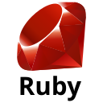
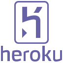
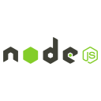
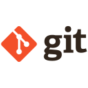
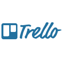
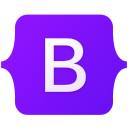
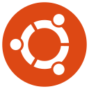
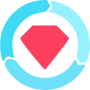

  

    
    
    
    

    

---

Full-stack engineer in Brisbane, Australia. I work primarily in TypeScript and Next.js, and I build AI and agent tooling: MCP servers and Claude Code agents and skills.
 
At [Labrys](https://labrys.io) I contribute to production applications across DeFi and agent platforms. My range covers React and React Native frontends, tRPC/Express/Koa/Hono backends, MongoDB and Drizzle data layers, and the infrastructure that ships them: Turborepo, Docker, Terraform, GitHub Actions, AWS, and Cloudflare Workers.
 
- 🔭 Building on-chain agent tooling with the Model Context Protocol and Turnkey signing
- 🌱 Currently working with TanStack Start on Cloudflare Workers
- 📫 Reach me at simon.tanna@proton.me

## AI and agent work
 
**On-chain agent platform** — A TanStack Start application backed by a Hono service, Drizzle ORM, and Clerk auth, deployed to Cloudflare Workers. A dedicated agent API builds an MCP server over Hono and signs transactions through Turnkey.
`TypeScript · MCP · Hono · Turnkey · Drizzle · viem · Cloudflare Workers`
 
**Claude Code tooling** — Agents, skills, hooks, and plugin manifests that extend Claude Code for repository workflows, packaged as a reusable configuration and a distributable plugin.
`Claude Code · Agents · Skills · Plugins`
 
**Realtime voice starter** — A LiveKit starter pairing a Python backend with a TypeScript frontend for realtime voice and AI.
`Python · TypeScript · LiveKit`
 
**Custom ESLint plugin** — A standalone plugin that enforces smart-contract lint rules, with its own Vitest suite and CI.
`TypeScript · ESLint plugin API · Vitest`
 
## Skills
 
**Languages:** TypeScript, JavaScript, Python, Solidity, GraphQL
 
**AI / Agents:** Model Context Protocol (MCP), Claude Code agents and skills, LiveKit
 
**Frontend:** React, Next.js, React Native, TanStack, Chakra UI, Radix UI, Tailwind CSS, Storybook
 
**Backend:** tRPC, Express, Koa, Hono, Socket.IO
 
**Data:** MongoDB, Drizzle ORM, GraphQL (Apollo, codegen), Zod, Redis
 
**Infra:** Turborepo, pnpm, Docker, Terraform, GitHub Actions, AWS, Cloudflare Workers, Vercel, Sentry
 
**Web3:** Hardhat, Foundry, OpenZeppelin, viem, ethers.js, thirdweb, Uniswap SDKs, LayerZero, Solana

---

## :hammer_and_wrench: Languages and Tools

  &nbsp;
  &nbsp;
  &nbsp;
  &nbsp;
  &nbsp;
  &nbsp;
  &nbsp;
  <!-- &nbsp; -->
  &nbsp;
  &nbsp;
  &nbsp;
  &nbsp;
  &nbsp;
  &nbsp;
  &nbsp;
  &nbsp;
  &nbsp;
  &nbsp;
  &nbsp;
  &nbsp;
  &nbsp;
  &nbsp;
  &nbsp;

  
---

## :fire: My Stats
  

  
---

<!--
**simon-tanna/simon-tanna** is a ✨ _special_ ✨ repository because its `README.md` (this file) appears on your GitHub profile.

Here are some ideas to get you started:

- 🔭 I’m currently working on ...
- 🌱 I’m currently learning ...
- 👯 I’m looking to collaborate on ...
- 🤔 I’m looking for help with ...
- 💬 Ask me about ...
- 📫 How to reach me: ...
- 😄 Pronouns: ...
- ⚡ Fun fact: ...
-->
